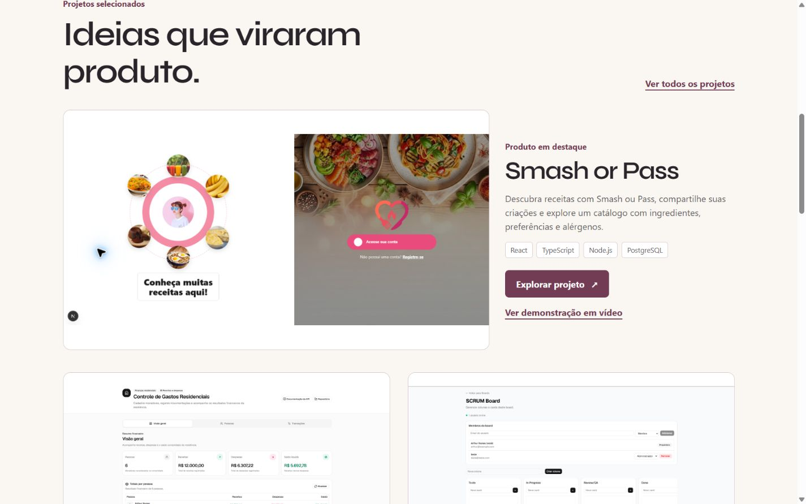
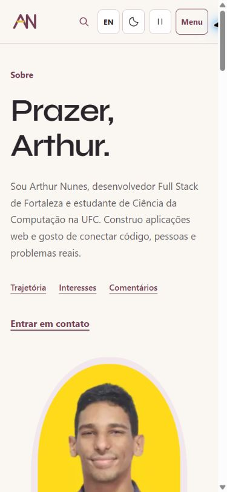

# Revisão no navegador conectado

Data: 2026-10-01, America/Fortaleza. Chrome conectado à aplicação local em `http://localhost:5173`. Revisão realizada sobre o servidor de desenvolvimento, sem publicação.

## Correções e refinamentos

- Removido `min-width: 320px` do body. Em viewport de 320 px com scrollbar de 15 px, o conteúdo disponível é 305 px; a largura mínima causava rolagem horizontal.
- Reposicionada a assinatura sobre o retrato em telas pequenas. A área transformada da decoração também podia ampliar a largura rolável.
- Acrescentados atalhos bilíngues para Trajetória, Interesses e Comentários na apresentação de Sobre, com margem de chegada às âncoras.
- Smash or Pass recebe rótulo de produto em destaque, ação principal para o caso e acesso direto à demonstração em vídeo já cadastrada.
- Links das imagens e de leitura dos projetos agora têm nomes acessíveis que identificam o projeto de destino.
- A base da abertura oferece um atalho para os projetos selecionados.

## Verificações realizadas

| Cenário | Evidência |
| --- | --- |
| Home em 390 e 1440 px | Hierarquia, cabeçalho, retrato e composição inspecionados visualmente nos temas claro e escuro durante a revisão. |
| Sobre em 320 e 390 px | Apresentação, atalhos e depoimentos inspecionados. Após as correções, `scrollWidth` e `clientWidth` retornaram 305 px no viewport de 320 px. |
| Contato em 768 px | Conteúdo inglês, endereço, ações e canais revisados; copiar e-mail exibiu confirmação. |
| Menu móvel | Abre, navega, fecha com Escape e devolve foco ao botão Menu. |
| Idioma | Português/inglês mantém `#comments`; busca por Rhyan mantém `?q=Rhyan` e retorna biografia e recomendação. |
| Depoimentos | Texto completo expande; tradução inglesa sinalizada e opção de leitura do original presente. |
| Movimento | Estado global ativo e animação CSS em execução na abertura; fora dela, `data-running=false` e `animation-play-state=paused`. Pausa preservada após reload. |
| Tema | Alternância visual conferida; modo escuro preservado após reload. |
| Execução | Nenhum erro ou warning retornado pelos logs consultados do navegador. Lint, TypeScript, 15 testes, build e verificação das 32 páginas passaram. |

A primeira aba estava com CSS antigo em memória. Reload carregou os estilos atuais; isso não foi confundido com um defeito na geometria da marca.

## Capturas

## Limites

Esta é uma revisão amostral, não uma certificação de acessibilidade. Não foram medidos Lighthouse em produção, taxa de quadros, consumo de energia ou desempenho em aparelho físico. Movimento reduzido segue coberto pelos testes de preferência e CSS, sem emulação do sistema nesta rodada. Revisão com leitor de tela, zoom de texto e todos os percursos de todas as páginas permanece pendente. Os PDFs continuam provisórios por instrução do autor.
